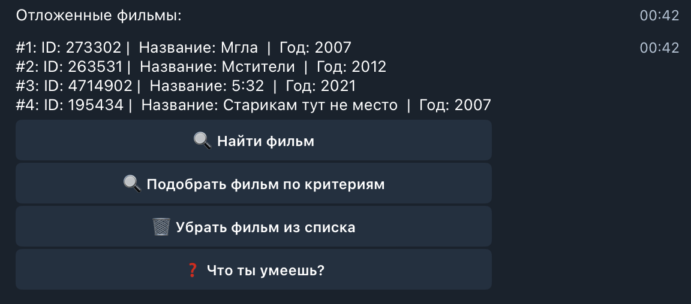

# [KinoBot](https://t.me/MovieLover404Bot)

---

## Вступление:

Перед вами представлен телеграмм бот который может искать и сохранять фильмы для каждого пользователя по отдельности. За основу был взять [KinopoiskApiClient](https://pypi.org/project/kinopoisk-api-unofficial-client/) который позволяет работать с API сервиса [Кинопоиска](https://www.kinopoisk.ru/?utm_referrer=www.google.com) от Яндекса.

Для хранения данных об "отложенных на потом" фильмов был использован SQL.

## Функционал:

Данный бот может:
- Искать фильм по названию.
- Искать похожие фильмы.
- Искать фильмы по критериям: жанр, год N сьемки (с N по настоящий день), рейтинг, страна.
- Сохранять/Удалять фильмы для каждого пользователя на потом.

### Пример функционала:

1) Поиск фильма по названию:
   
   

2) Подбор схожих фильмов:

3) Работа "отложенных на потом" фильмов:

  

4) Поиск фильмов по критерию:

## Как все устроенно:

- **Запуск** идет через файл main.py . Когда пользователь начинает диалог с ботом, второй сразу создает файл .sql формата для хранения "отложенных на потом" фильмов. В качестве названия он берет chat_id, так как он уникальный для каждой переписки. После польхователь может искать фильмы. 

- **Поиск фильма по названию** реализован в файле search_movie.py . В ней реализованны метод как поиска кино - def search(message), так и подбор схожих с данным фильмов каталог - def show_related(message).

- **Поиск фильмов по критерию** реализован в файле filter_movie.py . В ней реазилованны методы которые последовательно получают информацию о том, хочет найти пользователь. Как итог бот кидает по очередно список из 5-ти фильмов которые подошли по критрерию.

- За работу **"отложенных на потом" фильмов** отвечает файл database_logic.py . В ней реалиованны метода как добавление фильмов - def add_to_list(message), удаления фильмов - def delete_from_list(message), так и показ списка фильмов - def show_movies_list(message). Для добавления фильмов в список создает файл с названием chat_id в папке tmp_for_clients. Для удаления из списка фильмов, пользователь должен вручную вписать ID фильма.

---

P.S. ник бота: @MovieLover404Bot (но не факт что он всегда запущен)
